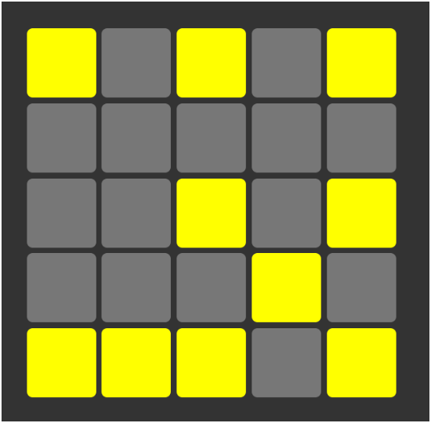

# Luces Apagadas

# Descripción

....

## Vista del Modelo

Aquí puedes ver la imagen del modelo que se utilizó como referencia:

## Vista Codificada

A continuación, se muestra la imagen del resultado obtenido:

## Autor

Este ejercicio fue realizado por **Valeria Torrealba**.